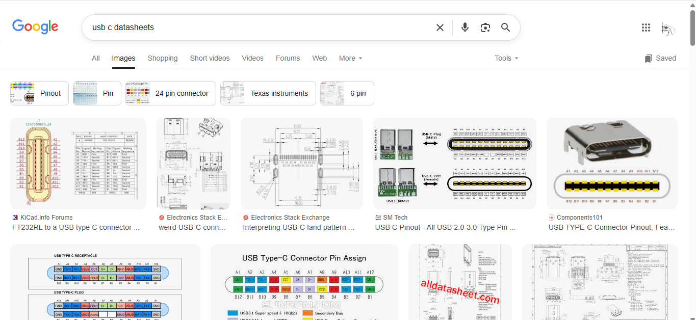

**this was only made because groundplane wouldn't load when i tried to upload a devlog and this is better for when im working offline anyways**

# 9th Aug, 2025: Looked for parts on JLCPCB and looked at example schematics  
Type: Research  
What I did: Watched the USB speedrun video and decided to start looking at parts for USB A and C on jlcpcb. Also looked at example schematics of how to connect the 2 together.  
Issues I faced: Could not find parts with schematic symbol that matched the pins on examples on the internet. Not knowing how a USB works and what each pin meant did not help either.  
Next Steps: Figure out a better way to research. Understand how a usb works and understand the meaning of each pin. Figure out how to better find parts on jlcpcb.  
Video evidence of today's work:  

**Total time spent: 2h 30m**  

# 11th Aug, 2025: Tried to understand starting from basics
Type: Research
What I did: Decided that my knowledge wasn't enough and started from the basics. Watched a video on how USBs worked and tried to look at datasheets of USB C.  
Issues I faced: still don't understand this 24 pin thing.  
Next Steps: Try USB A first, because video said USB A is a 4 pin thing. should be simpler to look at  
Screenshot of work:  
  
**Total time spent: 50m**

# Date: Summary  
Type: CAD, PCB, Hardware, Software, 3D Printing, Research  
What I did:  
Issues I faced:  
Next Steps:  
Screenshot or video:  
**Total time spend: 0h**  